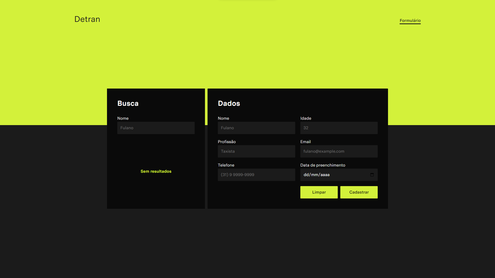

# Rethink Challenge

<div align='center'>
  
</div>

## Para testar o app localmente, siga os seguintes passos:

- Clonar o respositório
  ```bash
  git clone https://github.com/matosgabriel/rethink-challenge.git
  ```
- Instalar as dependências do projeto
  ```bash
  yarn install
  ```
  ```bash
  npm install
  ```
- Executar a api fake
  ```bash
  yarn fake-api
  ```
  ```bash
  npm run fake-api
  ```
- Executar o app em modo desenvolvedor
  ```bash
  yarn start
  ```
  ```bash
  npm run start
  ```
- Acessar o app via navegador no endereço http://localhost:3000

As funções requisitadas foram implementadas no arquivo funcoesFormulario.ts